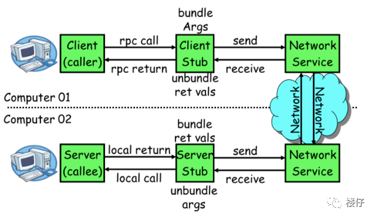
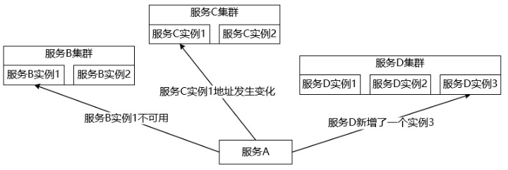
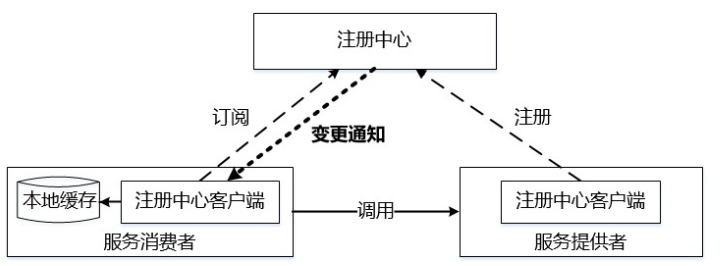

# Mprpc：分布式网络通信框架
## 项目介绍
该项目旨在构建一个分布式RPC网络通信系统，以实现在分布式环境中不同节点之间的远程过程调用。选择muduo库作为网络通信框架，因为它是一个高性能的C++网络库，提供了异步I/O、事件驱动和多线程支持，适合构建高效的网络通信。选择Protobuf进行数据序列化和反序列化，因为它可以将结构化数据转换为紧凑的二进制格式，提高了网络传输效率。Zookeeper则用于服务发现和管理，确保服务的可用性和负载均衡。


### 集群、分布式、微服务辨析
**集群**
集群是指将多台服务器集中在一起，每台服务器都实现相同的业务，做相同的事情。但是每台服务器并不是缺一不可，存在的作用主要是缓解并发压力和单点故障转移问题。
集群主要的使用场景是为了分担请求的压力。但是，当压力进一步增大的时候，可能存在在某些业务逻辑上压力大的问题，此外集群并没有合理考虑到不同设备可能存在性能差异的问题，而且，对于集群，如果后期需要重新编译代码，则集群中的每一台设备都需要重新编译。

**分布式**
分布式服务是指将多台服务器集中在一起，服务是分散部署在不同的机器上的。每台服务器都实现总体中的不同业务，做不同的事情，一个服务器可能负责好几个功能。各分开部署的部分彼此通过各种通讯协议交互信息，并且每台服务器都缺一不可，如果某台服务器故障(分布式设备没有做分布式集群，只有一台的情况下)，则部分功能缺失，或导致整体无法运行。
分布式存在的主要作用是大幅度的提高效率，缓解服务器的访问和存储压力。区别分布式的方式是一个业务分拆多个子业务，部署在不同的服务器上。根据节点的并发要求，对一个节点可以再做节点模块集群部署。

分布式是解决中心化管理的问题，把所有的任务叠加到一个节点处理，太慢了。所以把一个大问题拆分为多个小问题，并分别解决，最终协同合作。
分布式的主要工作是分解任务，把职能拆解。分布式的主要应用场景是单台机器已经无法满足这种性能的要求，必须要融合多个节点，并且节点之间的相关部分是有交互的。

集群和分布式及其区别：
分布式：把一个大业务拆分成多个子业务，每个子业务都是一套独立的系统，子业务之间相互协作最终完成整体的大业务。 
集群：把处理同一个业务的系统部署多个节点。
把一套系统拆分成不同的子系统部署在不同服务器上，这叫分布式。
把多个相同的系统部署在不同的服务器上，这叫集群。部署在不同服务器上的相同系统叫做“负载均衡”。 

集群主要是简单加机器解决问题，对于问题本身不做任何分解。
分布式处理里必然涉及任务分解与答案归并。分布式中的某个子任务节点，可以是一个集群，该集群中的任一节点都作为一个完整的任务出现。
集群和分布式都是由多个节点组成，但集群中各节点间基本不需要通信协调，而分布式中各个节点的通信协调是必不可少的。
                    
**微服务**
微服务是系统架构的一个设计方式，它是将复杂的业务拆分成多个微小的服务，每个服务可单独运行和部署，各个微服务之间是松耦合的，每个微服务仅关注于完成一件任务并很好地完成该任务，服务与服务之间可以采用RPC来通信。
微服务相比分布式服务来说，它的粒度更小，服务之间耦合度更低。由于每个微服务都由独立的小团队负责，因此它敏捷性更高。分布式服务最后都会向微服务架构演化，这是一种趋势。不过服务微服务化后带来的挑战也是显而易见的，例如服务粒度小，数量大，后期运维难度会增大。

以上三者的区别：
* 集群实质是将几台服务器集中在一起，实现同一业务
* 分布式是一种系统的部署方式，主要是将同一个服务，拆分成可以去部署到多台机器。
* 分布式中的每一个节点，都可以做集群，而集群并不一定就是分布式的
* 微服务是系统架构的一个设计方式，它是将复杂的业务拆分成多个微小的服务，每个服务可单独运行和部署，服务与服务之间可以采用RPC来通信。
* 分布式部署不一定是微服务架构，而微服务的应用也不一定是要采用分布式部署
* 微服务架构是分布式服务架构的子集


## RPC
### 什么是rpc
RPC(Remote Procedure Call Protocol)远程过程调用协议。一个通俗的描述是：客户端在不知道调用细节的情况下，调用存在于远程计算机上的某个服务对象，就像调用本地应用程序中的对象一样。
比较正式的描述是：一种通过网络从远程计算机程序上请求服务，而不需要了解底层网络技术的协议。


### RPC通信原理

1. 服务消费方(client)调用以本地调用方式调用服务；
2. client stub接收到调用后负责将方法、参数等组装成能够进行网络传输的消息体；
3. client stub找到服务地址，并将消息发送到服务端；
4. server stub收到消息后进行解码；
5. server stub根据解码结果调用本地的服务；
6. 本地服务(server端)执行并将结果返回给server stub；
7. server stub将返回结果打包成消息并发送至消费方；
8. client stub接收到消息，并进行解码；
9. 服务消费方得到最终结果。

RPC的目标就是要2~8这些步骤都封装起来，让用户对这些细节透明。通过动态代理模式，在执行该方法的前后对数据进行封装和解码等，让用于感觉就像是直接调用该方法一样，殊不知，我们对方法前后都经过了复杂的处理。


## 文件架构及使用方式
项目代码文件目录结构：
```
|--bin      存放可执行文件
|--build    cmake构建的中间文件
|--example  存放框架使用示例代码
|--include  存放头文件
|--lib      编译生成的动态库
|--src      项目源代码  存放框架代码
|--test     示例代码
|--autobuild.sh  一键编译
|--CMakeLists.txt  Cmake顶层目录配置文件
```

使用方式：用户可以通过运行autobuild.sh脚本一键编译项目文件，也可以通过如下步骤编译项目：
1. 进入buil目录
2. 执行`cmake ..`
3. 执行`make`
4. 如果没问题的话，会在bin目录生成相应的可执行文件


## 项目特点
* 基于muduo网络库实现高并发网络通信模块，作为RPC远程调用的基础。
* 基于Protobuf实现RPC方法调用和参数的序列化和反序列化，并根据其提供得RPC接口编写RPC服务。
* 基于ZooKeeper分布式协调服务中间件提供服务注册和服务发现功能。
* 基于生产者消费者模型，实现了异步工作方式的日志模块。


## 中间件选型
### Protobuf
#### Protobuf的作用
本项目使用Protobuf定义消息数据结构和定义通信协议，并对消息进行序列化和反序列化。定义了请求和响应的消息格式，以及其他需要传输的数据。protobuf自动生成的代码帮助我们将结构化数据序列化为二进制格式，从而在网洛上传输。使我们能够跨不同编程语言实现的节点进行数据传递，保证数据的一致性和高效性。
框架定义的RpcHeader如下：
```
syntax = "proto3";  //定义proto所用的语法

package mprpc; 

//开启生成通用服务代码的选项
option cc_generic_services = true;  

message RpcHeader
{
    bytes service_name = 1;  //服务名，类名
    bytes method_name = 2;   //方法名，调用的函数名
    uint32 args_size = 3;    //参数序列化后的长度
}
```
用户可通过如下示例定义自己的消息体：
```
syntax = "proto3";
package mprpc;
option cc_generic_services = true;

//定义错误消息状态
message ResultCode 
{
    int32 errcode = 1;   //值为0表示没有错误
    bytes errmsg = 2;
}

message GetFriendListRequest
{
    uint32 userid = 1;
}

message GetFriendListResponse
{
    ResultCode result = 1;
    repeated bytes friends = 2;  //repeated表明返回的是一个数组
}

//定义RPC服务
service FriendServiceRpc
{
    rpc GetFriendList(GetFriendListRequest) returns(GetFriendListResponse);
}
```


#### Protobuf相较于Json的优缺点
Protobuf和JSON都可以数据序列化和反序列化，但它们在许多方面有着显著的不同。以下是对两者的一些主要比较：
* 数据大小和速度：
Protobuf：由于Protobuf传输的是二进制格式，因此它生成的数据通常比JSON小很多，这使得Protobuf在网络传输中更加高效。同时，Protobuf的解析和序列化速度也比JSON快。
JSON：JSON是文本格式，它生成的数据通常比Protobuf大，且解析和序列化速度较慢。
* 可读性和易用性：
Protobuf：Protobuf是二进制格式，人类无法直接阅读。此外，使用Protobuf需要预先定义数据结构(.proto 文件)，这增加了使用的复杂性。
JSON：JSON是文本格式，人类可以直接阅读和编辑。此外，JSON的数据结构可以在运行时动态定义，这使得JSON更易于使用。
* 类型安全和版本兼容性：
Protobuf：Protobuf支持静态类型检查，这可以在编译时捕获类型错误。此外，Protobuf设计了一套版本兼容性机制，可以在不破坏旧版本的情况下添加新的字段。
JSON：JSON是动态类型的，无法在编译时捕获类型错误。此外，JSON没有内置的版本兼容性机制，如果数据结构发生变化，可能需要修改代码以适应新的结构。
* 支持的语言：
Protobuf：Google提供了多种语言的Protobuf库，包括C++、Java、Python、Golang等。
JSON：几乎所有的编程语言都支持JSON。
* 学习成本：
Protobuf：Protobuf的学习曲线相对较陡。你需要理解Protobuf的语法，学习如何编写.proto 文件，并且需要了解如何使用Protobuf编译器生成代码。此外，你还需要理解Protobuf的版本兼容性规则。
JSON：JSON的学习曲线相对较平。JSON的语法非常简单，大多数人可以在很短的时间内掌握。此外，几乎所有的编程语言都内置了JSON的支持，你不需要安装任何额外的库就可以开始使用JSON。
* 使用成本：
Protobuf：Protobuf的使用成本相对较高。首先，你需要为每个数据结构编写一个.proto 文件，然后使用Protobuf编译器生成代码。此外，如果你的数据结构发生了变化，你需要更新.proto文件并重新生成代码。这些步骤都需要额外的时间和工作。
JSON：JSON的使用成本相对较低。你可以直接在代码中定义数据结构，无需任何额外的步骤。此外，如果你的数据结构发生了变化，你只需要更新你的代码，无需任何其他操作。

总的来说，Protobuf和JSON各有优劣，适用于不同的场景。如果你需要高效的数据传输和严格的类型检查，那么Protobuf可能是一个好选择。如果你需要易于使用和人类可读的数据格式，那么JSON可能更适合你。


### Zookeeper
#### Zookeeper是为了解决什么问题
假设，系统中存在几十个、甚至上百个服务时，我们可能都无法明确系统中到底有哪些服务正在运行。而且由于自动扩容、服务重启等因素，服务实例的运行时状态也会经常变化。如下图所示：

一般来说，为了实现高效的服务治理，需要引入注册中心来管理服务的实例。
注册中心是服务实例信息的存储仓库，也是服务提供者和服务消费者进行交互的桥梁。它主要提供了服务注册和服务发现这两大核心功能。


#### Zookeeper上RPC服务注册/发现过程：

1. 服务提供者启动时，会将其服务名称，ip地址注册到配置中心。
2. 服务消费者在第一次调用服务时，会通过注册中心找到相应的服务的IP地址列表，并缓存到本地，以供后续使用。当消费者调用服务时，不会再去请求注册中心，而是直接通过负载均衡算法从IP列表中取一个服务提供者的服务器调用服务。
3. 当服务提供者的某台服务器宕机或下线时，相应的ip会从服务提供者IP列表中移除。同时，注册中心会将新的服务IP地址列表发送给服务消费者机器，缓存在消费者本机。
4. 当某个服务的所有服务器都下线了，那么这个服务也就下线了。
5. 同样，当服务提供者的某台服务器上线时，注册中心会将新的服务IP地址列表发送给服务消费者机器，缓存在消费者本机。
6. 服务提供方可以根据服务消费者的数量来作为服务下线的依据。